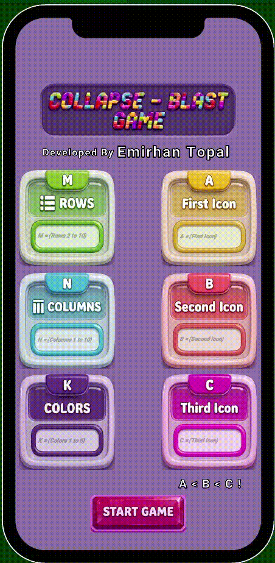

# Collapse-Blast-Game

**** Emirhan Topal ****

**** Screen Resolution : 1080x1920 ****

**** Collapse / Blast Mechanic: ****

The Collapse / Blast mechanic is a tile-matching game mechanic where players need to find groups of matching colored blocks. By tapping or clicking on these groups, the player removes the selected blocks from the board.

Once blocks are removed, the empty spaces are filled by falling blocks from above, along with new blocks that are generated to maintain the gameplay flow.

****

Unity Version 2022.3.18f1

**** Game Screen ****

